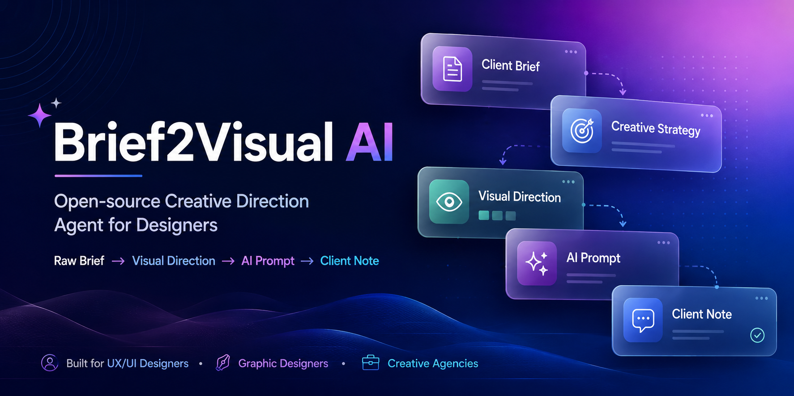
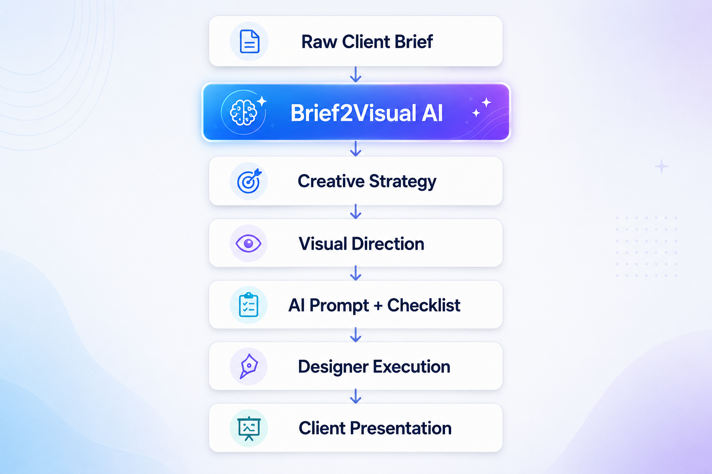
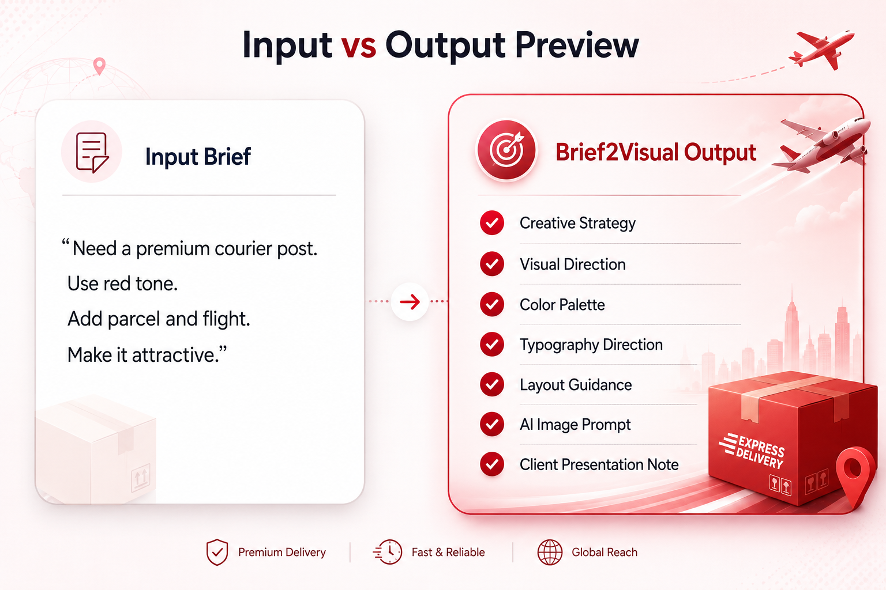
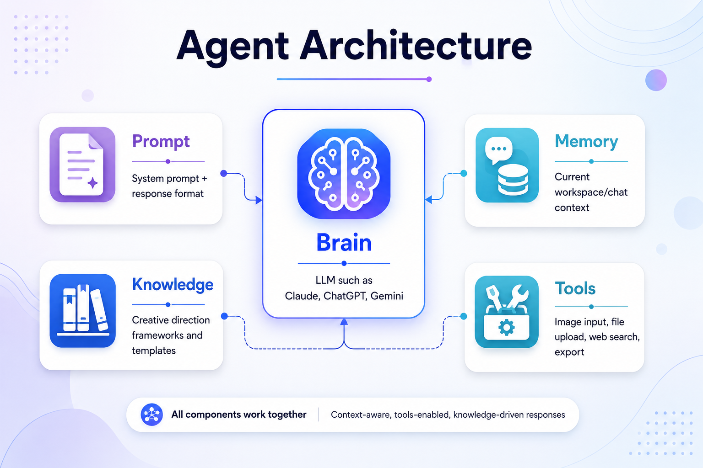

# Brief2Visual AI

**Open-source Creative Direction Agent for UX/UI & Graphic Designers**

Brief2Visual AI turns messy client briefs into designer-ready visual direction, layout guidance, color palettes, typography direction, AI image prompts, execution checklists, and client presentation notes.

---

## Why This Exists

Designers often receive vague briefs:

- "Make it premium"
- "Use this reference"
- "Need something modern"
- "Make it attractive"
- "Need a creative poster"

Brief2Visual AI helps convert unclear briefs into structured creative direction that designers can actually execute.

---

## What It Generates

- Brief understanding
- Creative strategy
- Visual direction
- Color palette
- Typography direction
- Layout direction
- AI image generation prompt
- Negative prompt / avoid list
- Design execution checklist
- Client presentation note
- Optional visual variations

---

## Who It Is For

- Graphic designers
- UX/UI designers
- Brand designers
- Social media designers
- Creative agencies
- Freelancers
- Design students
- Marketing teams

---

## How It Works



```text
Raw Client Brief
↓
Brief2Visual AI
↓
Creative Strategy
↓
Visual Direction
↓
Prompt + Checklist
↓
Designer Execution
↓
Client Presentation
```

## Input to Output Preview



## Agent Architecture



## Quick Start

To use Brief2Visual AI, choose the guide that fits your preferred AI platform:

- [Setup Guide for ChatGPT / Custom GPTs](setup-guides/use-with-chatgpt.md)
- [Setup Guide for Claude Projects / Claude.ai](setup-guides/use-with-claude.md)
- [Setup Guide for Claude Desktop App (as a Skill)](setup-guides/use-as-claude-skill.md)
- [Setup Guide for Gemini / Gemini Gems](setup-guides/use-with-gemini.md)

## Repository Structure

```text
├── agent/             # System prompts, response formats, and core behavior rules
├── assets/            # Graphical assets, diagrams, and workflow visuals
├── docs/              # Roadmap, testing framework, FAQ, and quality benchmarks
├── examples/          # Sample client briefs and generated visual direction outputs
├── knowledge/         # Specific guidebooks (color, typography, prompting, layouts, etc.)
├── setup-guides/      # Platform-specific instructions for running the agent
└── templates/         # Structural templates for input briefs and output summaries
```

## License

This project is licensed under the [MIT License](LICENSE).
